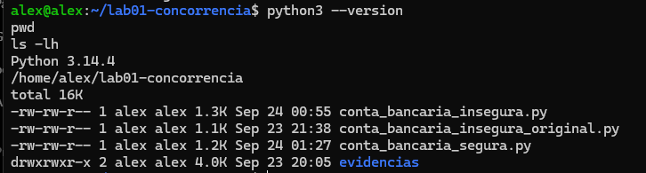
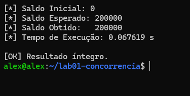

# Laboratório 01 — Concorrência, Threads e Race Conditions

Disciplina: Sistemas Operacionais  
Curso: Análise e Desenvolvimento de Sistemas (ADS)  
Semestre: 2026.2

## Objetivo

Demonstrar experimentalmente uma **condição de corrida (Race Condition)** causada pelo acesso concorrente de múltiplas threads a uma variável compartilhada e aplicar **exclusão mútua com `threading.Lock()`** para proteger a seção crítica e manter a integridade dos dados.

## Estrutura do projeto

```text
lab01-concorrencia/
├── conta_bancaria_insegura.py
├── conta_bancaria_insegura_original.py
├── conta_bancaria_segura.py
├── conta_bancaria_bonus.py
├── evidencias/
│   ├── 01_ambiente_python.png
│   ├── 02_race_condition.png
│   ├── 03_lock_resultado.png
│   └── 04_bonus_tres_threads.png
└── README.md
```

## Ambiente utilizado

- Ubuntu Server em máquina virtual
- Python 3.14.4
- Biblioteca padrão `threading`
- Duas threads na Parte 1 e Parte 2
- Três threads no desafio bônus



## Parte 1 — Condição de corrida

A versão insegura utiliza duas threads realizando depósitos sobre a mesma variável global `saldo_conta`.

A operação:

```python
temp = saldo_conta
temp = temp + 1
saldo_conta = temp
```

não deve ser entendida como uma única operação indivisível. Há uma sequência de leitura, modificação e escrita sobre um dado compartilhado. Se duas threads intercalarem essas etapas, ambas podem ler o mesmo valor e depois gravar resultados derivados daquele valor antigo, causando **perda de atualização**.

### Observação sobre o experimento

No ambiente utilizado, a versão original do código atingiu `200000` nas execuções iniciais. Para tornar a condição de corrida observável de forma didática, foi criada uma versão experimental com:

```python
time.sleep(0)
```

entre a leitura e a atualização do saldo. Essa instrução **não corrige o problema** e não faz parte da solução com Lock; ela apenas aumenta a oportunidade de troca de contexto entre as threads durante o experimento.

Em uma das execuções:

```text
Saldo Esperado: 200000
Saldo Obtido:   100000
```

O resultado demonstra perda de atualizações devido ao acesso concorrente sem sincronização.


## Parte 2 — Exclusão mútua com Lock

A versão segura protege a seção crítica utilizando:

```python
with lock_bancario:
    temp = saldo_conta
    temp = temp + 1
    saldo_conta = temp
```

Enquanto uma thread está dentro da seção protegida, a outra deve aguardar a liberação do Lock antes de modificar o mesmo saldo.

Resultado obtido:

```text
Saldo Esperado: 200000
Saldo Obtido:   200000
Tempo de Execução: 0.067619 s
```



## Questão 1 — Troca de contexto e atomicidade

A expressão `temp = temp + 1` seguida da atribuição ao saldo envolve várias etapas lógicas: obter um valor, realizar a soma e escrever o novo valor. Essas etapas podem ser intercaladas com a execução de outra thread.

Exemplo:

```text
Saldo inicial = 100

Thread 1 lê 100
Thread 2 lê 100

Thread 1 calcula 101
Thread 2 calcula 101

Thread 1 grava 101
Thread 2 grava 101
```

Embora tenham ocorrido dois depósitos, o saldo final ficou em `101`, e não `102`. Esse tipo de inconsistência ocorre quando a seção crítica não possui sincronização adequada.

## Questão 2 — Custo do Lock

Nas execuções originais sem a adaptação `time.sleep(0)`, foram observados os tempos:

| Execução | Sem Lock |
|---|---:|
| 1 | 0.017859 s |
| 2 | 0.021965 s |
| 3 | 0.022817 s |
| **Média** | **0.020880 s** |

Na versão segura, uma série anterior de testes apresentou aproximadamente:

| Execução | Com Lock |
|---|---:|
| 1 | 0.067423 s |
| 2 | 0.064856 s |
| 3 | 0.068343 s |
| **Média** | **0.066874 s** |

Neste experimento, a versão sincronizada levou cerca de **3,20 vezes** o tempo da versão original sem Lock.

O Lock adiciona overhead porque cada thread precisa adquirir e liberar o mecanismo de sincronização e pode ter de aguardar enquanto outra thread ocupa a seção crítica. Esse custo é a contrapartida pela garantia de integridade do dado compartilhado.

> A diferença de aproximadamente 3,20 vezes pertence a este ambiente e a estas execuções; não representa uma proporção universal para qualquer programa que utilize Lock.

## Desafio bônus — 3 threads

O desafio foi implementado com:

- Thread 1: 100000 depósitos de R$ 1,00;
- Thread 2: 100000 depósitos de R$ 1,00;
- Thread 3: 100000 saques de R$ 1,00.

Cálculo esperado:

```text
+100000
+100000
-100000
-------
 100000
```

Todas as alterações no saldo são protegidas pelo mesmo `Lock`.

Resultado:

```text
Saldo Esperado: 100000
Saldo Obtido:   100000
Tempo de Execução: 0.125015 s
```


## Conclusão

O laboratório demonstrou que o compartilhamento de dados entre threads exige sincronização quando existe uma seção crítica. Sem controle de acesso, diferentes interleavings podem produzir perda de atualização e resultados inconsistentes. Com `threading.Lock()`, apenas uma thread por vez modifica o saldo compartilhado, preservando o resultado esperado. O experimento também mostra que a sincronização possui custo de execução, mas esse custo está associado à garantia de consistência dos dados.
